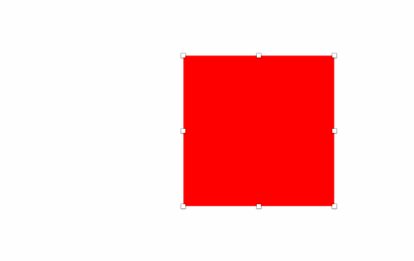

# Keyboard Resize for Sketch
A Sketch plugin that lets you resize objects from all sides with keyboard shortcuts. As a bonus you can specify the resize amount (which is by default set to 1 for the small and 10 for the big resize distance).

## Demo

## How this is different from the default Sketch behavior
Sketch only lets you expand and contract from the right and bottom side of an object. Even though this more easy to get used to, I often need to resize from other sides too. This plugin lets you do that.

## How to use
Press <kbd>Cmd</kbd> + arrow keys to add pixels to one of the sides. Press <kbd>ctrl</kbd> + <kbd>cmd</kbd> + arrow key to contract pixels from either side. Holding <kbd>shift</kbd> will increase the resize amount (default: 10px).

Specify the resize amount via 'Keyboard Resize › Set Small/Big Resize Distance'.

## Shortcuts
| Action     | Shortcut |
| :------- | :---- |
| Expand Top ++ | <kbd>cmd</kbd> + <kbd>shift</kbd> + <kbd>↑</kbd> |
| Expand Right ++ | <kbd>cmd</kbd> + <kbd>shift</kbd> + <kbd>→</kbd> |
| Expand Bottom ++ | <kbd>cmd</kbd> + <kbd>shift</kbd> + <kbd>↓</kbd> |
| Expand Left ++ | <kbd>cmd</kbd> + <kbd>shift</kbd> + <kbd>←</kbd> |
| Expand Top + | <kbd>cmd</kbd> + <kbd>↑</kbd> |
| Expand Right + | <kbd>cmd</kbd> + <kbd>→</kbd> |
| Expand Bottom + | <kbd>cmd</kbd> + <kbd>↓</kbd> |
| Expand Left + | <kbd>cmd</kbd> + <kbd>←</kbd> |
| Contract Top - | <kbd>cmd</kbd> + <kbd>ctrl</kbd> + <kbd>↓</kbd> |
| Contract Right - | <kbd>cmd</kbd> + <kbd>ctrl</kbd> + <kbd>←</kbd> |
| Contract Bottom - | <kbd>cmd</kbd> + <kbd>ctrl</kbd> + <kbd>↑</kbd> |
| Contract Left - | <kbd>cmd</kbd> + <kbd>ctrl</kbd> + <kbd>→</kbd> |
| Contract Top -- | <kbd>cmd</kbd> + <kbd>ctrl</kbd> + <kbd>shift</kbd> + <kbd>↓</kbd> |
| Contract Right -- | <kbd>cmd</kbd> + <kbd>ctrl</kbd> + <kbd>shift</kbd> + <kbd>←</kbd> |
| Contract Bottom -- | <kbd>cmd</kbd> + <kbd>ctrl</kbd> + <kbd>shift</kbd> + <kbd>↑</kbd> |
| Contract Left -- | <kbd>cmd</kbd> + <kbd>ctrl</kbd> + <kbd>shift</kbd> + <kbd>→</kbd> |
| Set Big Resize Distance | - |
| Set Small Resize Distance | - |

## Installation
 1. [Download](https://github.com/ANGIstudio/Keyboard-Resize/archive/master.zip) the plugin.
 2. Unzip and run ‘Keyboard Resize.sketchplugin’ to install

## Thanks to
This plugin is inspired by John Dunning's [Keyboard Resize](http://johndunning.com/fireworks/about/KeyboardResize), a Fireworks plugin I've used for a long time!

## Feedback
If you find any issues or have any suggestions, please create an issue. Pull requests are welcome also!

## Created by
[Andre Jilderda](https://github.com/ajilderda) @ [Angi Studio](http://www.angistudio.com), The Hague (NL)
